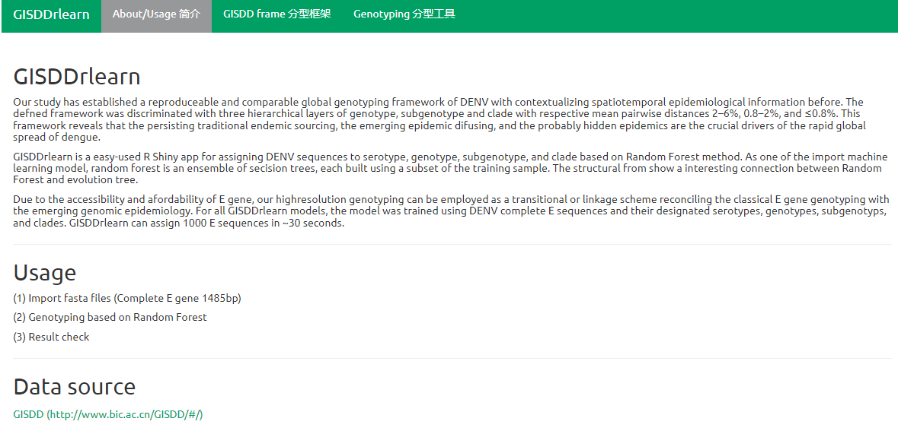

# GISDDrlearn
GISDDrlearn is a easy-used R Shiny app for assigning DENV sequences to serotype, genotype, subgenotype, and clade based on Random Forest method. As one of the import machine learning model, random forest is an ensemble of secision trees, each built using a subset of the training sample. The structural from show a interesting connection between Random Forest and evolution tree.

Due to the accessibility and afordability of E gene, our highresolution genotyping can be employed as a transitional or linkage scheme reconciling the classical E gene genotyping with the emerging genomic epidemiology. For all GISDDrlearn models, the model was trained using DENV complete E sequences and their designated serotypes, genotypes, subgenotyps, and clades. GISDDrlearn can assign 1000 E sequences in ~30 seconds.

## Overview



## 

## Installation

```
library(devtools)
install_github('GuoXiang9399/GISDDrlearn')
```

```
library(GISDDrlearn)
```

Dependency:  r-package: shiny, tidyr,ape
```
library(shiny)
library(tidyr)
library(ape)
library(caret)
library(ranger)
```

## Usage

```
shiny::runApp('GISDDrlearn')
```

## Contributing
Xiang Guo  Southern Medical University, China